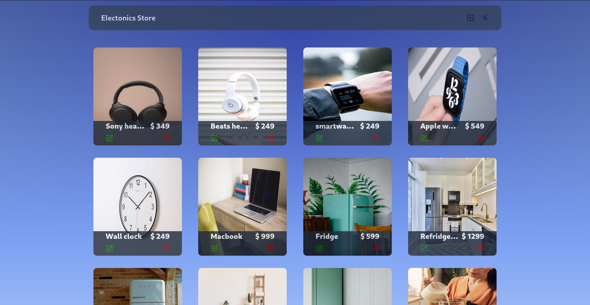

# Electronics Store

This is a full-stack e-commerce project that allows users to view, add, edit, and delete products. It has a **React frontend** and a **Node.js/Express backend** with a MongoDB database.

## 📸 Screenshot


## 🚀 Features
- Display a list of electronic products with images, names, and prices
- Add new products
- Edit existing products
- Delete products
- Modern UI with smooth interactions

## 🛠️ Tech Stack
### Frontend:
- React.js (Vite)
- TypeScript
- Tailwind CSS
- ShadCN/UI
- Lucide Icons

### Backend:
- Node.js
- Express.js
- MongoDB (Mongoose)

## 📦 Installation
### 1️⃣ Clone the repository
```sh
git clone https://github.com/your-username/electronics-store.git
cd electronics-store
```

### 2️⃣ Install dependencies
#### Frontend
```sh
cd frontend
npm install
npm run dev
```

#### Backend
```sh
cd backend
npm install
```

### 3️⃣ Set up environment variables
Create a `.env` file inside the `backend` directory and add the following:
```sh
MONGO_URI=your_mongodb_connection_string
```

### 4️⃣ Start the backend server
```sh
npm start
```

## 📡 API Endpoints
| Method | Endpoint                 | Description          |
|--------|--------------------------|----------------------|
| GET    | `/api/v1/products`       | Get all products    |
| POST   | `/api/v1/products`       | Add a new product   |
| PUT    | `/api/v1/products/:id`   | Update a product    |
| DELETE | `/api/v1/products/:id`   | Delete a product    |

## 🔥 Usage
1. Start the backend server (`http://localhost:5000`)
2. Run the frontend (`http://localhost:5173` or as configured)
3. Add, edit, or delete products from the UI


---
Feel free to contribute or suggest improvements! 😊

